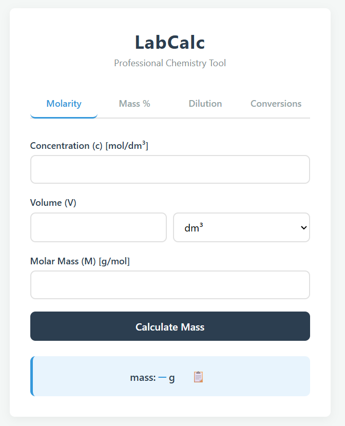

# 🧪 LabCalc (Professional Solution Preparator & Unit Converter)

## 📸 Preview



A high-precision web application designed for chemists, researchers, and students to automate complex laboratory calculations and ensure accuracy in solution preparation.

## 🔬 The Intersection of Chemistry & Code

As a **Master of Organic Chemistry**, I engineered this tool to replace manual calculations and prone-to-error spreadsheets.

- **Scientific Integrity:** Developed using standard IUPAC notation, including correct lowercase symbols for mass concentration (γ) and mass fraction (ω).
- **Precision First:** Implements 4-decimal precision for molar calculations, mirroring the sensitivity of analytical balances.

## 🌟 Features

- **Molarity Calculator:** Calculate required mass for specific molar concentrations (c) with integrated volume unit conversion (cm³ ↔ dm³).
- **Mass Percent Hub:** Effortlessly determine the mass of both solute and solvent for percentage-based solutions.
- **Dilution Engine:** Practical c₁V₁ = c₂V₂ logic that automatically calculates the exact volume of stock solution and the required amount of water to add.
- **Professional Conversions:** Advanced conversion cards for switching between c, γ, and ω, accounting for density (ρ) and molar mass (M).
- **One-Click Copy:** Integrated clipboard functionality with smart formatting (📋 icon) for quick data transfer to lab notebooks.
- **Minimalist Lab UI:** A clean, distraction-free interface optimized for use in laboratory environments with a strict focus on scientific notation.
- **Intelligent Feedback System:** Custom "Toast" notification system for real-time error reporting and successful action confirmations (e.g., Copy to Clipboard).

## 🛠️ Tech Stack

- **HTML5:** Semantic structure with a focus on logical input flow and accessibility.
- **CSS3:** Modern minimalist design using **CSS Variables**, Flexbox, and **Strict Text Transformation** rules to preserve lowercase scientific symbols (γ, ω).
- **JavaScript (ES6+):**
  - **State Management:** Implemented using a central `LabCalc` object to manage application state and logic.
  - **Event Delegation:** Optimized performance by handling interactions through dynamic event listeners.
  - **Keyboard Accessibility:** Integrated `Ctrl/Cmd + 1-4` shortcuts for a seamless laboratory workflow.
  - **Robust Validation:** Custom validation engine that prevents non-physical results (e.g., negative mass or concentrations exceeding 100%).
  - **Smart Clipboard API:** Advanced copy logic with a reliable fallback for older browser environments.

## 🧪 Educational Goals & Learning Outcomes

This project demonstrates proficiency in:

1. **Complex Algorithm Mapping:** Translating multi-variable chemical formulas into clean, efficient JavaScript code.
2. **State Management:** Handling real-time UI updates across multiple calculation modules without page reloads.
3. **UI/UX for Specialized Tools:** Creating a professional tool that prioritizes clarity and speed, avoiding unnecessary "bloat".
4. **Scientific Accuracy:** Maintaining strict adherence to international scientific standards in software naming and notation.

## 🚀 Roadmap

This project is under continuous development. Upcoming features include:

- [x] **Unit Testing:** Jest test suite implemented to verify calculation accuracy for core formulas.
- [ ] **Authentication:** Integration with **Firebase Auth** to allow users to save and retrieve their custom solution recipes.
- [ ] **History Log:** A persistent record of recent calculations for experimental reproducibility.

## 🚀 Installation & Usage

1. Clone the repository or download the source code.
2. Open `index.html` in any modern web browser.
3. Choose your calculation tab and start preparing your solutions with 100% confidence.

## 🧪 Testing

This project uses **Jest** for unit testing to ensure calculation accuracy.

**Setup & Run Tests:**

```bash
npm install
npm test
```

Tests verify the core calculation logic across molarity, dilution, mass percent, and concentration conversion functions.

---

### 👩‍🔬 Author

**[Ivana Tatić]**
_Master of Organic Chemistry & Aspiring Web Developer_

Feel free to connect or check out my other projects!
